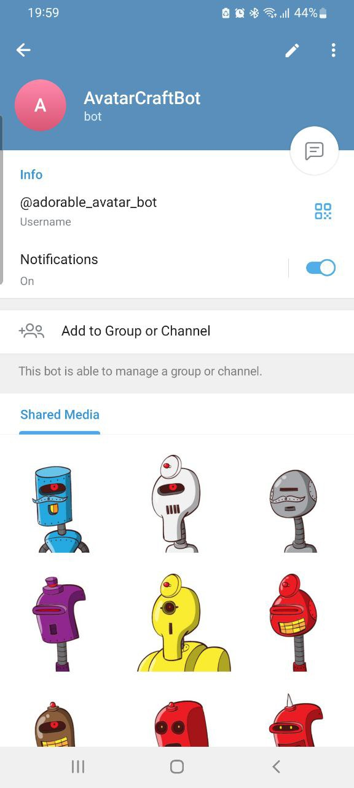

# adorable-craft-bot

This is a simple Telegram bot built using Flask and deployed on Heroku. The bot interacts with users via webhooks and makes direct API calls to Telegram.



[Link](https://t.me/adorable_avatar_bot)

## Features

- Responds to messages sent by users.
- Responds to text with an avatar photo and handles basic commands like `/start`.
- Uses Flask to handle incoming webhook updates from Telegram.
- Deployed on Heroku with environment variables to manage secrets.

## Prerequisites

Before running the bot, ensure you have the following:

- A **Telegram Bot Token** from [BotFather](https://core.telegram.org/bots#botfather).
- **Python 3.10** or higher installed.
- **Heroku CLI** for deployment to Heroku.

## Local Setup

1. **Clone the repository**:

   ```bash
   git clone https://github.com/Bluette1/adorable-craft-bot
   cd adorable-craft-bot
   ```

2. **Install dependencies**:

   ```bash
   pip install -r requirements.txt
   ```

3. **Set environment variables**:

   Use credentials file or create a `.env` file (recommended) in the root directory of your project and add your Telegram bot token:

   ```bash
   TELEGRAM_BOT_TOKEN=your_telegram_bot_token
   ```

   - Adjust code to import environment variables accordingly.

4. **Run the Flask application**:

   ```bash
   gunicorn app:app
   ```

   Use Ngrok or another tunneling tool to expose your local server to the internet if you want to test the bot locally.

5. **Set up the webhook** (if running locally with Ngrok):

   After running the app and getting your public URL from Ngrok, set your webhook:

   ```bash
   curl -X POST "https://api.telegram.org/bot<Your-Bot-Token>/setWebhook?url=https://your-ngrok-url/webhook"
   ```

## Deployment to Heroku

1. **Login to Heroku**:

   ```bash
   heroku login
   ```

2. **Create a Heroku app**:

   ```bash
   heroku create your-app-name
   ```

3. **Set your environment variable**:

   ```bash
   heroku config:set TELEGRAM_BOT_TOKEN=your_telegram_bot_token
   ```

4. **Deploy to Heroku**:

   ```bash
   git push heroku master
   ```

   If you're using a different branch (e.g., `main`):

   ```bash
   git push heroku main
   ```

5. **Set the webhook** for your Heroku app:

   After deployment, set the webhook with your Heroku app URL:

   ```bash
   curl -X POST "https://api.telegram.org/bot<Your-Bot-Token>/setWebhook?url=https://your-app-name.herokuapp.com/webhook"
   ```

Or run:
```
python -m bot/webhook.py
```

## Available Commands

The bot supports basic commands like:

- `/start`: Sends a greeting message.
- Other text messages return an avatar photo.

## Environment Variables

- `TELEGRAM_BOT_TOKEN`: The token for your Telegram bot obtained from BotFather.

## License

This project is licensed under the MIT License - see the [LICENSE](LICENSE) file for details.

## Contributing

Feel free to submit pull requests or open issues if you find bugs or want to improve the codebase.


